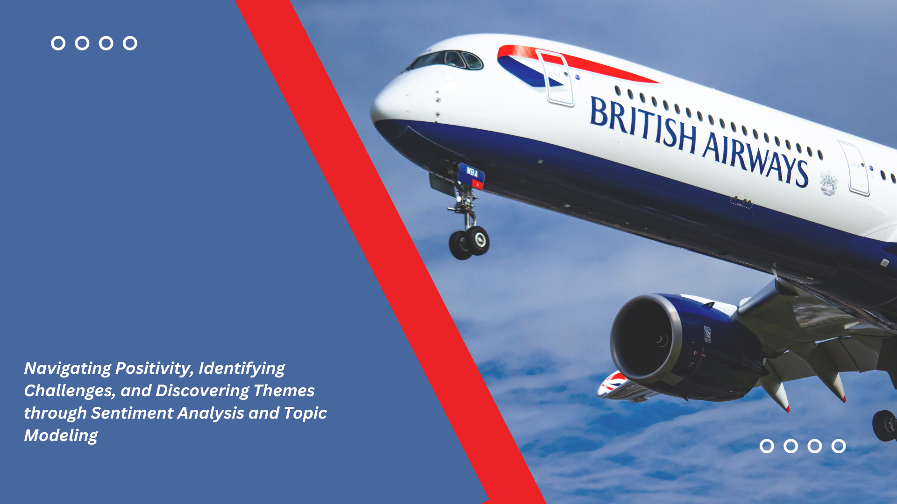
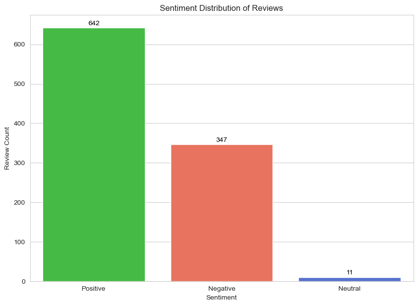

# British Airways Customer Reviews Analysis
*Web scraping project to gain company insights*

# Introduction
British Airways (BA) is the flag carrier airline of the United Kingdom (UK). Every day, thousands of BA flights arrive to and depart from the UK, carrying customers across the world. Whether it’s for holidays, work or any other reason, the end-to-end process of scheduling, planning, boarding, fuelling, transporting, landing, and continuously running flights on time, efficiently and with top-class customer service is a huge task with many highly important responsibilities.

# Objective
* Develop and execute a web scraping strategy to collect customer feedback related to BA's services.
* Review and analyze data obtained from third-party sources, identifying patterns, trends, and key insights.
* Utilize analytical skills to extract valuable information regarding customer feelings, needs, and opinions.
* Provide recommendations based on the analyzed data to enhance customer experience and inform business decisions.

# Tools Used
* Jupyter Notebook (Python)
* Matplotlib
* Seaborn
* Pandas
* Numpy
* Textblob
* WordCloud
* Latent Dirchilet Allocation
* CountVectorizer
* BeautifulSoup
* Requests

# Analysis
**Sentiment Analysis**

## Overview

- In the initial phase of my analysis, I conducted sentiment analysis on customer reviews to gauge the overall sentiment towards British Airways. The sentiment scores were derived using the TextBlob library in Python. This library provides a simple and intuitive way to analyze the sentiment of text data, assigning polarity scores to indicate the positivity or negativity of the content. Additionally, the analysis includes subjectivity scores, which measure the degree of objectivity or subjectivity in the reviews. The sentiment scores were then used to categorize each review into one of three categories: 'Positive,' 'Neutral,' or 'Negative,' based on the polarity scores.

## Findings

*The above bar plot conveys the sentiment distribution across a set of customer reviews, segmented into three distinct categories: Positive, Negative, and Neutral*

The predominant height of the Positive sentiment bar indicates a majority of favorable evaluations, overshadowing the less frequent Negative sentiments and the scarcely represented Neutral feedback. This distribution implies a favorable overall perception by the reviewers, with a substantial number expressing satisfaction. The lesser, yet significant, volume of Negative reviews highlights areas where improvements could be beneficial. The scarcity of Neutral sentiment suggests that the experiences being reviewed generally elicit a definitive opinion, either affirmatively or adversely.

# Word Clouds Analysis
I utilized word cloud visualizations to identify the most frequent words associated with customer reviews. This visual approach allowed me to pinpoint dominant themes and topics across the dataset.

**Positive Sentiment Word Cloud:**
**Using Word Cloud to Visualize Top 20 Positive Reviews**

*The word cloud above represents Positive Sentiment Reviews. It is a visual compilation of the most frequently mentioned terms within favorable feedback. It highlights areas of customer satisfaction through the prominence of certain words, reflecting key aspects of the airline’s service that have resonated positively with passengers.*

The following insights can be gleaned from the areas of importance indicated by the size and frequency of the words:

- **Service:** Its prominence in the word cloud underscores the crucial role that quality service plays in creating positive customer experiences. The emphasis on service points to its perceived value among passengers.
- **Seat:** The visibility of this word suggests that seating both its comfort and the options available is a significant contributor to passenger satisfaction.
- **Food and Drink:** These terms are noticeable and indicate that the food and beverage offerings on board are generally appreciated by customers, contributing positively to their overall experience. 
- **Flight:** The word ‘flight’ appears large and central, indicating that it is a common theme in positive reviews. This likely pertains to the general flight experience, encompassing various elements such as punctuality, smoothness of the journey, and overall comfort.
- **Crew:** The word ‘crew’ is indicative of favorable interactions or experiences with the airline’s staff, highlighting the impact of personal service on the flight experience.
- **Business Class:** The term ‘business class’ is distinct within the cloud, which points to a higher level of satisfaction among passengers traveling in this premium category.
*These insights reflect the airline’s successful areas from the perspective of its customers and can be used to maintain and enhance service quality where it is most appreciated.*

**Visualizing Top 20 Negative Reviews**

*The word cloud for Negative Sentiment Reviews displays the words most commonly found in unfavorable British Airways reviews, giving us clues about what might be upsetting customers. The size and prominence of certain words highlight the primary concerns.*

The negative sentiment word cloud sheds light on common concerns expressed by customers in unfavorable reviews:
- **Time and Delayed:** These big words in the cloud tell us that customers often mention being unhappy about flights not being on time. This includes flights leaving late or taking too long.
- **Seat:** Since ‘seat’ pops up a lot in negative reviews, it seems that people are not always happy with their seating. It could be because the seats aren’t comfortable, there’s not enough room, or they had trouble getting the seat they wanted.
- **Food:** ‘Food’ shows up in both good and bad reviews, which means that sometimes the meals on the plane are a hit, and other times people really don’t like them.
- **Staff:** The word ‘staff’ here suggests that sometimes the people working on the plane or at the airport might not be making customers happy, maybe because they aren’t as helpful or friendly as expected.
- **London:** Seeing ‘london’ in the cloud hints that some problems might be linked to flights going to or coming from London, or maybe things happening at London’s airports.

*These insights draw attention to the operational and service areas where the airline could focus its improvements to enhance customer satisfaction and reduce negative feedback.*

# Topic Modeling

**Using CountVectorizer and LatentDirichletAllocation for Topic Modeling**

**CountVectorizer** is a feature extraction technique used in natural language processing (NLP) to convert text data into numerical feature vectors. It is a part of the scikit-learn library in Python. CountVectorizer operates by tokenizing text documents, converting them into a matrix of token counts.

**Latent Dirichlet Allocation (LDA)** is often categorized as a topic modeling technique, it can also be considered a form of feature engineering. It processes the features created by **CountVectorizer** (or another vectorizer) to discover the underlying topics in a text corpus. In doing so, it generates a new set of features related to the topics within the documents. Each document is then described by its distribution of topics, and each topic is characterized by its distribution of words. These topic distributions can be used as features in downstream tasks, such as document classification, and clustering, or as part of a recommendation system.

## Topic Modeling Results

**Latent Dirichlet Allocation (LDA)**
I applied Latent Dirichlet Allocation (LDA) to identify underlying topics within the customer reviews.
**Identified Topics:**
- **Topic #1:** class, flight, food, good, seat, ba, business, service, crew, seats
- **Topic #2:** flight, ba, tokyo, british, airways, tour, service, crew, heathrow, lhr
- **Topic #3:** flight, ba, service, london, time, british, airways, staff, hours, heathrow
- **Topic #4:** flight, ba, airline, hours, time, luggage, help, airport, nov, airways
- **Topic #5:** flight, heading, seats, ba, airways, british, flights, london, glory, airport

**Topic 1:**

- Dominant words: class, flight, food, good, seat, ba, business, service, crew, seats
- Insight: This topic highlights experiences related to flying in business class. Customers appreciate the quality of service, good food, and comfortable seats provided by British Airways. The use of “business” suggests a positive sentiment associated with premium class travel.

**Topic 2:**

- Dominant words: flight, ba, tokyo, british, airways, tour, service, crew, heathrow, lhr.
- Insight: This topic centers around flights to Tokyo with British Airways. Customers discuss the service quality, crew interactions, and possibly experiences at Heathrow Airport (“heathrow” and “lhr”). The term “tour” indicates a potential discussion about travel tours or sightseeing activities associated with these flights.

**Topic 3:**

- Dominant words: flight, ba, service, london, time, british, airways, staff, hours, heathrow.
- Insight: This topic focuses on flights to and from London, particularly Heathrow. Customers discuss the service quality, staff interactions, and possibly the duration of flights (“hours”). The mention of “heathrow” suggests a connection to the London airport.

**Topic 4:**

- Dominant words: flight, ba, airline, hours, time, luggage, help, airport, nov, airways.
- Insight: This topic covers various aspects of flying with British Airways, including discussions about the airline itself, help with luggage, and experiences at the airport. The mention of “nov” might be related to specific events or experiences in November.

**Topic 5:**

- Dominant words: flight, heading, seats, ba, airways, british, flights, london, glory, airport.
- Insight: This topic encompasses discussions about flights with British Airways, focusing on aspects such as seat comfort, heading to different destinations, and experiences at airports. The term “glory” suggests positive or memorable experiences associated with flying.

*Each topic represents a different facet of the flying experience, with Topics 1 and 2 focusing on premium class and flights to Tokyo, Topic 3 on flights to and from London, Topic 4 on general airline experiences, and Topic 5 on overall flight experiences and destinations.*

*The accompanying Jupyter notebook in the 'Notebook' folder provides a detailed narrative of how all analyses were carried out.*

# Conclusion
- In conclusion, this comprehensive analysis of British Airways customer reviews offers a detailed perspective on passenger sentiments and key areas of concern. This wealth of insights equips British Airways with the tools needed for strategic decision-making aimed at boosting customer satisfaction. By proactively addressing identified pain points, capitalizing on positive aspects, and instituting continuous monitoring practices, British Airways can foster a customer-centric approach. This, in turn, has the potential to solidify the airline's standing in the competitive aviation industry. The findings from this analysis serve not only as a roadmap for immediate enhancements but also as a foundational resource for ongoing improvements. It underscores the impactful role of data-driven insights in steering operational excellence and shaping a positive customer experience.

# Recommendation
**Operational Challenges Require Attention:**
- Negative sentiments often revolve around operational issues, especially flight delays. Addressing these challenges can significantly enhance overall service reliability.

**Seating Comfort is Paramount:**
- Both positive and negative sentiments consistently highlight the importance of seating comfort. Emphasizing this aspect can contribute to overall customer satisfaction.

**Premium Class Experiences Stand Out:**
- Positive sentiments associated with business class indicate a strong positive perception. Investing in and promoting premium services can further elevate customer satisfaction.

**Customer Feedback Loop:**
- Establish a robust customer feedback loop for continuous monitoring. Regularly collect and analyze customer feedback to identify evolving trends, address emerging concerns, and maintain a proactive approach to customer satisfaction.

**London-Specific Improvements:**
- Address concerns related to flights to and from London, especially Heathrow Airport. Implement improvements or adjustments that enhance the overall experience for customers traveling through London.

**Continuous Improvement Culture is Vital:**
- The importance of ongoing improvements is emphasized. Establishing a culture of continuous enhancement based on customer feedback ensures sustained positive experiences.
